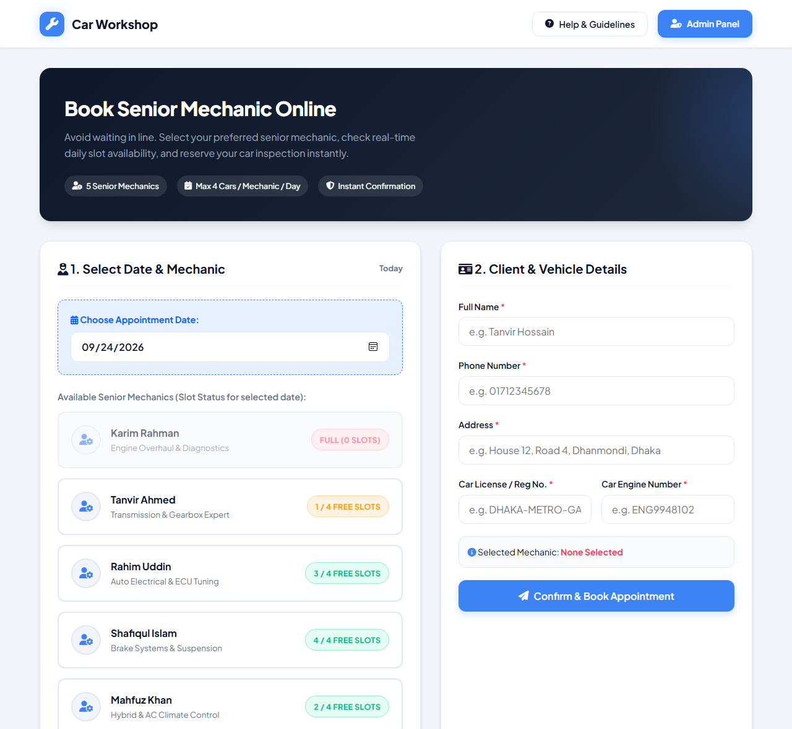
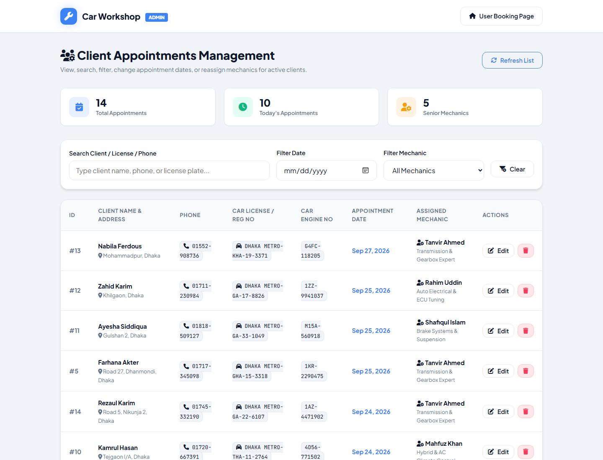
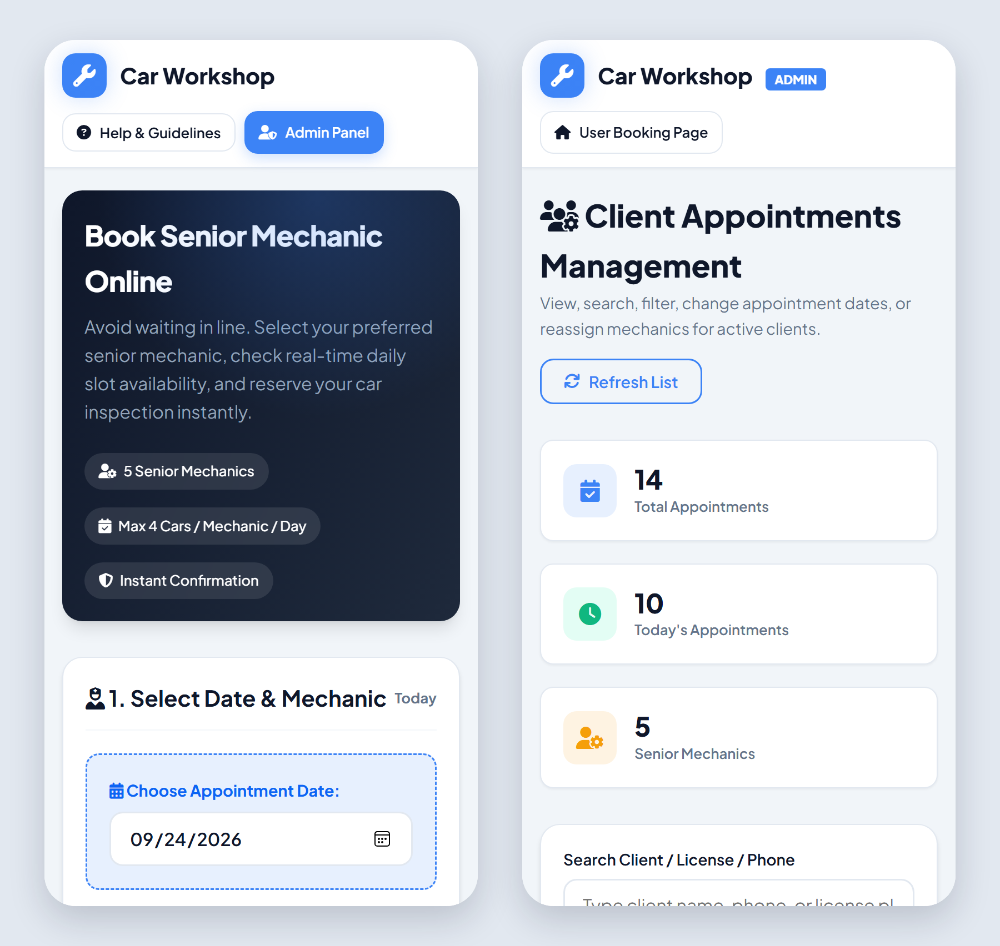

# Car Workshop Appointment System

[](https://github.com/tanjilaafsarirubina/car-workshop/actions/workflows/ci.yml)

An online booking system for a car workshop. Clients pick a date, see how many
slots each of the five senior mechanics has left that day, and book one. An
admin panel lists every appointment and lets staff search, reschedule, reassign
or cancel them. Built with plain PHP, vanilla JavaScript and MySQL (or SQLite),
with no framework.



## Booking rules

The server enforces these rules. The browser checks the same things first so
users get quick feedback, but the API does not trust it:

- **Each mechanic takes at most 4 cars a day.** Once a mechanic is full on a
  date, the booking page greys them out and the API returns `MECHANIC_FULL`.
- **One appointment per client per day.** A client is matched by phone number
  *or* car licence plate, so changing one of them doesn't get around the rule
  (`DUPLICATE_CLIENT`).
- **No past or impossible dates.** `2027-02-30` is rejected, not silently
  turned into March 2.
- **Admin edits follow the same rules.** Rescheduling or reassigning can't
  overbook a mechanic or give a client two bookings on one day.

### Two people booking the last slot at once

"Count the bookings, then insert one" is a race: two requests can both see
3/4 and both insert. Running 20 simultaneous bookings for one mechanic against
MySQL showed the original code approving **5, 6 and up to 11 cars** for a
4-slot day. Bookings and edits now take a write lock first (`SELECT … FOR
UPDATE` on MySQL, `BEGIN IMMEDIATE` on SQLite), so the same test approves
exactly 4 every time. CI repeats this check on every push, against both
databases.

## Admin panel



- Live search by client name, phone, licence plate or engine number
- Filter by date and by mechanic
- Edit modal that shows each mechanic's free slots on the chosen date and
  disables anyone who is full
- Total and today's appointment counters

It also works on phones:



## Run it locally

You need PHP 8 with `pdo_sqlite`. XAMPP or any recent PHP install works.

```bash
git clone https://github.com/tanjilaafsarirubina/car-workshop.git
cd car-workshop
php -S localhost:8000
```

Open <http://localhost:8000>. With no database configured, the app creates
`workshop.sqlite` on the first request and seeds the five mechanics. The admin
panel is at `/admin.php`.

### Using MySQL instead

```bash
mysql -u root -p -e "CREATE DATABASE car_workshop_db CHARACTER SET utf8mb4"
mysql -u root -p car_workshop_db < database.sql
cp config.local.example.php config.local.php   # then fill in your credentials
```

`config.local.php` is git-ignored. You can also set `DB_DRIVER`, `DB_HOST`,
`DB_PORT`, `DB_NAME`, `DB_USER` and `DB_PASS` as environment variables. If
MySQL is unreachable, the app falls back to SQLite.

"Today" is Dhaka time (`Asia/Dhaka`) whatever the server's clock is set to.
Override it with `APP_TIMEZONE`.

## Tests

`tests/api_test.php` drives the real API over HTTP. It has 36 checks: validation,
both booking rules, admin search and filters, edits, cancellation and the
concurrency test above.

```bash
PHP_CLI_SERVER_WORKERS=8 php -S localhost:8000 &
php tests/api_test.php http://localhost:8000
```

Run it against a fresh database. `PHP_CLI_SERVER_WORKERS` lets PHP's built-in
server handle requests in parallel (Linux/macOS only). Without it the
concurrency test still passes but doesn't prove much. [CI](.github/workflows/ci.yml)
runs the suite against SQLite and against MySQL 8 loaded from `database.sql`,
and lints the PHP and JavaScript.

## API

Everything goes through `api.php?action=…` and returns JSON with a `success`
flag and a `message`.

| Action | Method | Parameters | Returns |
|---|---|---|---|
| `get_slots` | GET | `date` | Each mechanic with `booked_count`, `available_slots`, `is_full` |
| `book` | POST | `client_name`, `address`, `phone`, `car_license`, `car_engine`, `appointment_date`, `mechanic_id` | `appointment_id`, or an `error_type` of `DUPLICATE_CLIENT` / `MECHANIC_FULL` |
| `get_appointments` | GET | `search`, `date`, `mechanic_id` (all optional) | Appointments joined with mechanic name and specialty |
| `update_appointment` | POST | `id`, `appointment_date`, `mechanic_id` | Result message |
| `cancel_appointment` | POST | `id` | Result message (the row is deleted) |

Every query that takes user input goes through a PDO prepared statement.

## Project layout

```
index.php          booking page
app.js             booking page logic: slot cards, form validation, submit
admin.php          admin dashboard
admin.js           admin table, filters, edit modal
api.php            JSON API with all the booking rules
config.php         database connection (MySQL → SQLite fallback), seeding
database.sql       MySQL schema and the five mechanics
style.css          all styles
tests/api_test.php end-to-end API tests
```

## Limitations

This is a course project, not production software:

- **The admin panel has no login.** Anyone who can reach `admin.php` or
  `api.php?action=get_appointments` can see every client's name, phone and
  address, and can cancel bookings. Before real use it needs authentication
  (and CSRF protection on the POST actions).
- Cancelling deletes the row. The `status` column exists but nothing sets it to
  `cancelled` yet.
- The admin panel's mechanic filter and the "5 Senior Mechanics" counter are
  hard-coded rather than read from the database.
- There is no live demo. The original deployment on InfinityFree free hosting
  has been taken down; the screenshots above show the current version.

## Changes since the graded submission

The version submitted for the course is commit
[`52e9335`](https://github.com/tanjilaafsarirubina/car-workshop/tree/52e9335).
It is unchanged apart from the database password, which has been redacted
from the repository history. Since then:

- Database credentials moved out of `config.php`, which used to hold the live
  MySQL password, into a git-ignored `config.local.php` or environment
  variables. The app now runs on SQLite with no setup.
- The double-booking race described above is fixed.
- Stricter date checks: impossible dates are rejected, and admin edits can no
  longer set a past date or free text like `not-a-date`.
- "Today" follows Dhaka time, both on the server and in the admin panel's
  "Today's Appointments" counter, which used to count by UTC date.
- The admin edit modal no longer shows an extra free slot ("5 / 4") for the
  current mechanic after the date is changed.
- The booking page's date badge now shows the selected date instead of always
  saying "Today".
- The layout no longer scrolls sideways on phones.
- Added tests, CI, screenshots and this README.

## Credits

Built by **Tanjila Afsari Rubina** for CSE391 (Assignment 3, Summer 2026).
The AI-use declaration submitted with the assignment is in
[`docs/AI_DECLARATION_SIMPLE.txt`](docs/AI_DECLARATION_SIMPLE.txt).

Released under the [MIT License](LICENSE).
